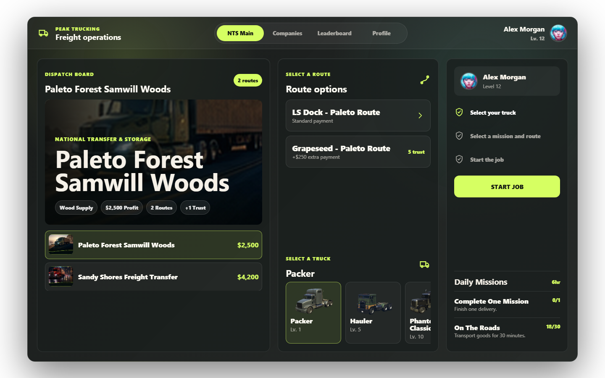

# Peak Trucking

[](LICENSE)
[](version.json)
[](https://dsc.gg/peakstudios)

Peak Trucking is a premium open-source FiveM trucking resource with persistent driver progression, company trust, daily missions, leaderboards, legal freight, optional illegal cargo, and a React-based NUI dispatch tablet.



## Noir Truck V1 — Mercado Global (Noir State)

Este fork substitui a lista estática de missões por um **Mercado Global** server-authoritative,
conforme `resources/docs/noir_truckjob/NOIR_TRUCK_V1.md`:

- Um único quadro compartilhado por todo o servidor, renovado a cada hora (`Config.ContractBoard.rotationMinutes`).
- 3–7 cargas únicas por rotação (1–2 baixas, 1–2 médias, 1–3 altas), geradas de forma determinística e persistidas em `peak_trucking_global_offers`.
- Cada carga pertence ao **primeiro motorista elegível** cujo início o servidor confirma (UPDATE atômico); um contrato por motorista por rotação.
- As 16 missões, 37 rotas, coordenadas, spawns, modelos e fluxos especiais do catálogo (`Config.Missions`) permanecem intactos; as ofertas apontam para `missionId:routeIndex` via `Config.RouteMeta` (`shared/contract_config.lua`).
- Sessão autoritativa (`server/contracts.lua`): fases validadas por proximidade, veículo registrado por net ID, tempo mínimo plausível, conclusão idempotente por `session_id`.
- Avaliação S–D (integridade 40 / pontualidade 25 / etapas 20 / devolução 15) com pagamento explicado: base × bônus de mercado × nota − penalidades.
- XP determinístico (`baseXP` × nota), reputação vitalícia por empresa (não consumível), missões diárias progredidas apenas por conclusões validadas.
- Histórico normalizado em `peak_trucking_deliveries`; migração automática e idempotente no start (`install/install.sql` documenta o esquema).
- NUI: `NTS Main` virou o Mercado Global (timer do servidor, estados das ofertas, disputa com feedback de conflito, relatório de entrega), Companies com patamares de reputação, Profile com nota/breakdown, ranking sem mocks e locale `pt-BR`.
- Dinheiro passa pela bridge `bgrz_core` quando o resource está ativo (`server/custom.lua`).

Comando de auditoria (console/admin): `trucking_rotation` mostra a rotação atual e o estado das ofertas.

## Features

- Mission and route selection with truck level requirements
- Company trust points and mission unlocks
- Driver XP, levels, completed jobs, earnings, and recent work history
- Daily mission progress and reset handling
- Leaderboard data stored in SQL
- Optional illegal cargo side job with target system integration (ox_target/qb-target)
- Cancel active jobs from the dispatch UI or with `/canceltrucking`
- Automatic job cancellation when the required truck, trailer, or attached cargo is destroyed
- Movable Job HUD via `/truckhud` command with persistence
- Framework support for QBCore and ESX (modern and legacy)
- Inventory support for `ox_inventory`, `qb_inventory`, `esx_inventory`, and `qs_inventory`
- Interaction support for `drawtext`, `ox_target`, `qb_target`, `qb_textui`, and `esx_textui`
- Vite React + TypeScript NUI built into `ui/dist`

## Dependencies

- `oxmysql`
- A supported framework: QBCore or ESX
- Optional inventory/interaction resources based on your configuration

## Installation

### 🤖 AI-First Setup (Recommended)
If you are using an AI coding assistant (like Claude, ChatGPT, or Cursor), you can set up this resource in seconds:
1. Open [PROMPT.md](PROMPT.md).
2. Copy the content and paste it into your AI assistant.
3. Follow its instructions to automatically configure the framework, inventory, key system, and database for your server.

### Manual Setup
1. Place this folder in your server resources as `peak-trucking`.
2. Import [install/install.sql](install/install.sql) into your database.
3. Configure [shared/config.lua](shared/config.lua) and [server/server-config.lua](server/server-config.lua).
4. Ensure dependencies before this resource:

```cfg
ensure oxmysql
ensure peak-trucking
```

## UI Development

The source NUI app is in [ui](ui). Build it before release:

```powershell
cd ui
npm install
npm run build
```

The FiveM manifest loads `ui/dist/index.html`. Keep `ui/dist` in release archives and do not include `ui/node_modules`.

## Configuration

- **[shared/config.lua](shared/config.lua)**: Framework, SQL driver, inventory, interactions, vehicles, missions, fuel, keys, XP, and gameplay settings.
- **[shared/language.lua](shared/language.lua)**: UI and gameplay text strings.
- **[server/server-config.lua](server/server-config.lua)**: Server-only optional settings such as Discord bot token and version checks.

## Changelog

### Unreleased

- Added a configurable `/canceltrucking` command through `Config.CancelJobCommand`.
- Improved the existing dispatch UI Cancel Job action so it clears truck, trailer, attached cargo, carried boxes, waypoints, blips, HUD state, and server job sessions.
- Added automatic job cancellation when the active truck, required trailer, or attached cargo is destroyed.
- Cleared server-side illegal cargo sessions when a job is canceled or the player disconnects.

## Publishing Notes

- Do not publish live Discord bot tokens or credentials.
- Keep `ui/dist` committed or packaged for server use.
- Do not include `ui/node_modules` in releases.
- Review mission coordinates and item names before publishing a server-specific fork.

## Contributing

Contributions are welcome. Please read [CONTRIBUTING.md](CONTRIBUTING.md) and [CODE_OF_CONDUCT.md](CODE_OF_CONDUCT.md) before opening issues or pull requests.
