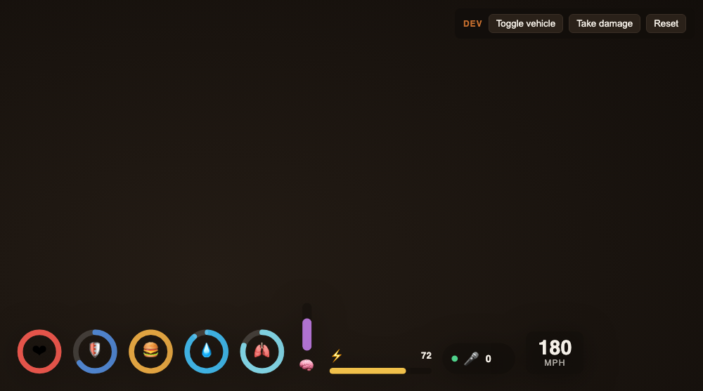
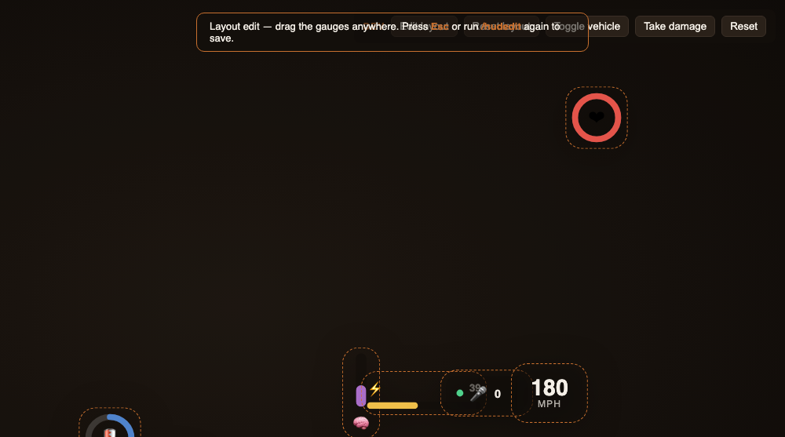

# Rember HUD

A **white-label, component-based HUD framework** for FiveM (and RedM). Every
metric is just a data value; every gauge is a swappable component; every gauge
can be dragged anywhere on screen. Reskin, restyle, and rearrange the entire HUD
without touching UI code — the design flexibility *is* the product.

- **Repo:** `https://github.com/rled7/rember-hud`
- **One-liner:** data-driven NUI with six gauge styles, a toggle-per-component
  config, a per-player drag-to-place layout editor, and a thin Lua bridge. No
  build step, no runtime dependencies.



## Table of contents

1. [The idea](#the-idea-sell-the-framework-ship-the-designs)
2. [Features](#features)
3. [Preview it](#preview-it-no-server-needed)
4. [Move gauges anywhere](#move-gauges-anywhere-in-game-layout-editor)
5. [Install](#install-fivem)
6. [Feed it data](#feed-it-data-from-any-resource)
7. [The component library](#the-component-library)
8. [Architecture](#architecture)
9. [Engineering decisions & trade-offs](#engineering-decisions--trade-offs)
10. [Problems we hit & notable solutions](#problems-we-hit--notable-solutions)
11. [What's tested vs. not](#whats-tested-vs-not)
12. [License](#license)

> **Standalone.** No framework dependency — runs on QBCore, ESX, qbox, and
> custom servers. Native stats (health/armor/stamina/voice/speed) are read
> automatically; anything else (hunger/thirst/stress/…) is a value any resource
> can feed in.

## The idea: sell the framework, ship the designs

Buyers don't want *a* HUD — they want *their* HUD. So this ships as a kit:

- **Six gauge styles** in the box: `radial`, `segment`, `bar`, `vbar`, `pill`,
  `text`. Any metric can use any style.
- **Everything is a toggle.** Each component has `enabled` and a `style`. A demo
  set ships enabled; extra sample gauges ship present-but-`enabled = false`.
- **White-label theming.** Accent, position, scale, and panel opacity live in one
  `Config.Theme` block.
- **Movable gauges.** Players drag each gauge wherever they want; the layout is
  saved per-player.

## Features

- Data-driven components (below), each binding a `key` to a display `style`.
- Native stats read automatically; custom stats fed by any resource.
- In-game **drag-to-place** layout editor with per-player persistence.
- `/hud` show-hide, `/hudedit` move gauges, `/hudreset` restore defaults.
- Browser **DEV mode** that enables every style and animates values — a live
  design catalog / Tebex demo.

## Preview it (no server needed)

```bash
cd html && python3 -m http.server 8066
```

Opened directly, it enters **DEV mode**: every style enabled, values animated,
and an Edit-layout / Reset-layout toolbar.

## Move gauges anywhere (in-game layout editor)

- Run **`/hudedit`** → every gauge gets a drag handle. Drag each anywhere (clear
  a corner for something else, spread them out, stack them). Run `/hudedit` again
  or press **Esc** to save.
- Layout is **saved per-player** via `SetResourceKvp`, surviving reconnects.
  **`/hudreset`** restores defaults.
- Works in the browser preview too (persisted to `localStorage`).



## Install (FiveM)

1. Drop the folder into `resources/` (e.g. `resources/[hud]/rember-hud`).
2. `ensure rember-hud` in `server.cfg`.
3. Commands: **`/hud`** · **`/hudedit`** · **`/hudreset`**.

## FiveM & RedM

The manifest declares `games { 'gta5', 'rdr3' }`, so the same package loads on
both platforms; the UI is identical (shared CEF). The **only** thing that differs
is which native stats are read — set it with one line:

```lua
Config.Game = 'gta5'   -- FiveM (default)
Config.Game = 'rdr3'   -- RedM
```

- **FiveM (`gta5`)** — reads health, armor, sprint stamina, voice, oxygen, and
  vehicle speed. Verified.
- **RedM (`rdr3`)** — RDR2 has **no armor**, and health/stamina are **attribute
  cores**; you ride a **mount** rather than sit in a car. The RedM branch reads
  the health/stamina cores and mount/wagon speed (armor and oxygen simply have no
  data, so those gauges hide). Every RedM native call is guarded with `pcall`, so
  a mismatch degrades to `0` instead of erroring.
  > ⚠️ **The RedM native mappings are best-effort and not yet verified on a live
  > RedM server** — core native hashes/ranges can vary by build. Test and adjust
  > `nativeValuesRdr3()` in `client.lua` before shipping to RedM buyers.

## Feed it data from any resource

```lua
exports['rember-hud']:SetValue('hunger', 82.5)
exports['rember-hud']:SetValues({ hunger = 82.5, thirst = 60, stress = 15 })
exports['rember-hud']:SetHudVisible(false)
```

A component's `key` is just the value name — declare a component for `stress`,
push a `stress` value, and it renders.

## The component library

| style | look | good for |
|---|---|---|
| `radial` | round ring gauge | health, armor, core stats |
| `segment` | segmented ring (ticks light up) | hunger, thirst — a distinct RP look |
| `bar` | horizontal bar + number | stamina, any 0–100 value |
| `vbar` | vertical bar | compact clusters |
| `pill` | icon + number pill | voice, on/off indicators |
| `text` | big number + unit | speedometer |

Per-component flags: `hideAtZero`, `hideAtFull`, `vehicleOnly`, and `segments`
(tick count for `segment`).

## Architecture

```
 config.lua  → white-label settings: theme, position, scale, component list
 client.lua  → reads native stats, merges custom values, streams to NUI;
               exports SetValue/SetValues/SetHudVisible; /hudedit + KVP layout
 html/
   index.html → HUD overlay + edit hint
   script.js  → builds one component per enabled config entry; updates values;
                drag-to-place editor + layout save/load
   style.css  → the six gauge styles + edit-mode styling
```

- `client.lua` sends `{action='config', components, theme, scale, layout}` once,
  then `{action='update', values}` every `Config.UpdateMs`.
- `html/script.js` builds a DOM component per **enabled** entry and updates only
  the values each tick. The `key → style` mapping is the whole API.
- The `html/` UI is game-agnostic → ports to **RedM** unchanged (manifest
  `game 'rdr3'` + native reads differ).

## Engineering decisions & trade-offs

### 1. Data-driven components (the UI knows nothing about "health")

**Choice:** the renderer takes a list of components (each a `key` + `style`) and
a stream of named values. It has no built-in concept of any specific stat.

This is what makes the HUD white-labelable and lets *any* script feed it. **What
we rejected:** hard-coding health/armor/hunger gauges into the UI — simpler for
exactly those stats, but every customization becomes a core-code edit and no
outside script can add a metric.

### 2. Six styles as a swappable library

**Choice:** ship a library of gauge styles and let a single config field pick per
metric. Restyling hunger from a segmented ring to a vertical bar is a one-word
change. The breadth of styles is the selling point, so it's the core investment.

### 3. Absolute per-gauge positioning + a drag editor

**Choice:** each gauge is absolutely positioned and individually draggable in an
edit mode; layout persists per-player.

**Rejected:** a single fixed HUD anchor (or a flex row) with one position setting.
That's less code, but players want their HUD *their* way — moved out of the way,
spread out, or clustered. Per-gauge free positioning is the feature that turns a
look into a product. Trade-off: slightly more layout/persistence code, and gauges
no longer auto-flow (a default row is provided as the starting point).

### 4. Layout persistence via KVP (not a database)

**Choice:** `SetResourceKvp` stores each player's layout locally. Zero setup, no
DB, per-client — exactly right for a UI preference. (Layout is cosmetic, so
client-local storage is appropriate here.)

### 5. Shared ring geometry for `radial` and `segment`

**Choice:** both ring styles use the same angle convention (degrees clockwise
from 12 o'clock) and the same arc math, so gauges stay visually consistent and a
change to one can't silently desync the other.

### 6. Standalone + exports; emoji icons

Native stats auto-read; custom stats via exports; no framework dependency (widest
market). Icons are emoji — zero-asset and instantly themeable, at the cost of
minor per-system rendering differences (a buyer can swap in images).

## Problems we hit & notable solutions

- **Caught during the build: an inverted armor flag.** The armor gauge was first
  configured with `hideAtFull` (which would hide armor when it's at 100 — the
  opposite of useful). It was corrected to `hideAtZero` (hide when you have no
  armor). Cheap to fix, but a good example of why the flags are explicit and
  per-component.
- **Edit mode overrides hide rules.** While editing, all components show (even
  ones normally hidden by `hideAtZero`/`vehicleOnly`) so you can position them;
  the rules re-apply on save. Otherwise you couldn't place a gauge that happens
  to be hidden at that moment.
- **Verified via the DevTools Protocol:** all six styles build for a given
  config, segmented rings light the correct number of ticks, values update live,
  and — for the editor — a gauge dragged from its default position updates live
  and persists on exit. No console errors.

## What's tested vs. not

- **Verified in a real browser (CDP):** all six gauge styles render; segment tick
  counts are correct; values update; drag-to-place moves a gauge and persists it.
- **Not yet exercised in-game:** the native stat reads (health/armor/**stamina**/
  voice/**oxygen**/speed) and `SetResourceKvp` persistence. The native values are
  standard, but stamina/oxygen scaling can vary by server/build and may want a
  tweak in `client.lua` — flagged honestly.

## License

MIT (your code). No third-party runtime libraries.
