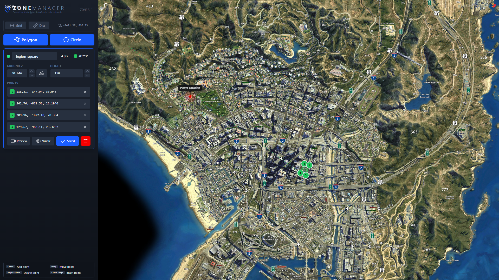
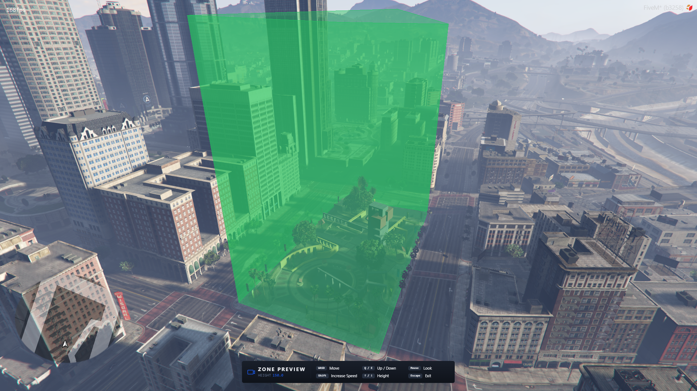

# ZoneManager

A standalone, framework-agnostic FiveM resource for drawing, saving, and querying 3D polygon and circle zones. Ships with an in-game free-cam viewer and a 2D Leaflet map editor.

---

<p align="center">
  <a href="https://github.com/itsxScrubz/fivem-zonemanager/releases"></a>
  <a href="https://github.com/itsxScrubz/fivem-zonemanager/stargazers"></a>
  <a href="https://github.com/itsxScrubz/fivem-zonemanager/issues"></a>
  <a href="https://github.com/itsxScrubz/fivem-zonemanager/commits"></a>
</p>

<p align="center">
  
  
  
	
</p>

---

## Preview

**2D map editor:**



**In-game 3D viewer:**



---

## $\textcolor{red}{\textbf{IMPORTANT}}$

$\textcolor{red}{\textbf{ZERO}}$ testing has been done against ESX, QBCore, or Qbox - I have $\textcolor{red}{\textbf{ZERO}}$ interest in standing up a separate server for each just to confirm the integrations work. Framework-integration bugs will $\textcolor{red}{\textbf{NOT}}$ get fixed unless someone else submits a pull request. Core-logic bugs are another matter; those I will fix if an issue is raised.

---

## Note

Instead of recoding MOST of the ui, I instead chose to rip out the relevant components from my `@nextgen/ui` package inside my frameworks workspace and just placed it inside `ui/src/lib/ui`. I'm lazy and didn't want to go thru all that trouble honestly. So feel free to use them in other projects! ^_^

## At a glance

<table>
<tr>
<td width="33%" align="center">

### 🧩 Framework-agnostic

Runs on standalone, ESX, QBCore, Qbox, or your own framework. One setting.

</td>
<td width="33%" align="center">

### 🗺️ Visual editor

2D Leaflet map + in-game free-cam viewer with live height adjust.

</td>
<td width="33%" align="center">

### 📦 Zero dependencies

No framework required. cfx ace gates the editor by default.

</td>
</tr>
</table>

---

## Features

- **Polygon + circle zones** - draw a ring of points or a center + radius, each with a per-zone height (vertical extrusion).
- **2D map editor** - place, drag, insert, and delete points on a Leaflet GTA-map view; live distance + grid overlays.
- **In-game viewer** - free-cam over the zone, walls drawn in world space, arrow keys nudge the height live.
- **Schema-versioned persistence** - zones saved to `data/zones.json`; old files are backed up and migrated forward automatically, written in a fixed field order for clean diffs.
- **Public API** - `Enable` / `Disable` / `IsEnabled` / `IsInside` / `GetCurrentZones`, `AttachZoneToEntity` / `DetachZone` for zones that follow a live entity, plus `pcall`-isolated `OnEnter` / `OnExit` subscriptions (each fired with the crossing coords) so one bad handler can't break the rest.
- **Server-side queries** - `IsPointInZone` / `GetZonesAt` test the canonical saved data on the server, so server logic can gate on zones without trusting a client-reported crossing.
- **Distance-scaled polling** - zones far from the player re-test on a stretched cadence (400ms past 40m, 1s past 120m), so a large zone set costs near-nothing while you're across the map.
- **Server-authoritative admin gate** - the editor command and save path are gated server-side and re-checked on every save, so the editor can't be reached by forging a net event.
- **Zero runtime dependencies** - no framework required; pick one only if you want its admin check.

---

## Installation

```bash
# 1. drop the resource into your server
cd resources
git clone https://github.com/itsxScrubz/fivem-zonemanager zonemanager

# 2. ensure it in server.cfg (after your framework, if any)
ensure zonemanager
```

```cfg title="server.cfg"
# standalone admin grant (skip if using a framework adapter)
add_ace group.admin zonemanager.editor allow
```

> [!NOTE]
> The NUI is prebuilt in `ui/dist`. To rebuild it, see the `ui/` project (`bun install` then `bun run build`).

---

## Configuration

`config.lua` has two settings.

| Key                | Type     | Default        | Description                                                  |
|:-------------------|:---------|:--------------:|:-------------------------------------------------------------|
| `config.framework` | `string` | `'standalone'` | Admin source: `standalone` \| `esx` \| `qbcore` \| `qbox` \| `custom`. |
| `config.callbacks` | `string` | `'internal'`   | Editor fetch/save transport: `internal` \| `framework`. |

```lua title="config.lua"
config = {}
-- 'standalone' needs no framework and gates on cfx ace.
config.framework = 'standalone'
-- 'internal' works on any framework; 'framework' uses the framework's native callbacks.
config.callbacks = 'internal'
```

`config.framework` picks which `server/framework/<name>.lua` adapter is loaded (see Framework setup).

**`config.callbacks`** chooses how the editor's fetch/save round-trips travel:

- `'internal'` (default) - a built-in token shim over net events. Works on any framework, including standalone.
- `'framework'` - the framework's native callback system (ESX / QBCore / Qbox). On `standalone` or `custom` (no native callbacks) it falls back to `'internal'` and logs a warning.

The server admin gate on save is enforced the same way under both transports.

---

## Framework setup

Each framework's admin check lives in its own adapter under `server/framework/`. Only the selected one is loaded.

| `config.framework` | What it uses                                         | Setup                                              |
|:-------------------|:-----------------------------------------------------|:---------------------------------------------------|
| `standalone`       | cfx ace                                              | `add_ace group.admin zonemanager.editor allow`     |
| `esx`              | `xPlayer.getGroup() == 'admin'`                      | none beyond ESX running                             |
| `qbcore`           | `QBCore.Functions.HasPermission(src, 'admin'/'god')` | none beyond QBCore running                          |
| `qbox`             | `IsPlayerAceAllowed(src, 'group.admin')`             | none; Qbox admins are in the `group.admin` ace      |
| `custom`           | your code                                            | edit `server/framework/custom.lua`                 |

```lua title="server/framework/custom.lua"
-- WIRE YOUR FRAMEWORK HERE (the only file to edit)
return {
	isAdmin = function(src)
		-- return MyFramework.IsAdmin(src)
		return false
	end,
}
```

> [!NOTE]
> Each adapter grabs its framework object lazily (ESX via `getSharedObject()`, QBCore via `GetCoreObject()`), so load order never matters. Qbox needs no object - it is ace-based. The ESX adapter also works if you prefer the `@es_extended/imports.lua` import.

---

## Commands

| Command        | Access            | Description                          |
|:---------------|:------------------|:------------------------------------|
| `/zonemanager` | admin (see setup) | Opens the zone editor for the caller. |

The gate is enforced **server-side**. The save round-trip re-checks admin independently, so the editor can't be reached by forging the net event.

---

## API

From another resource:

```lua
local ZoneManager = exports.zonemanager:FetchModule()
```

`FetchModule` returns a different surface per side: the **client** module below, or the **server** query module (`GetZones` / `IsPointInZone` / `GetZonesAt`).

### Value methods (client)

| Method               | Returns            | Description                          |
|:---------------------|:-------------------|:-------------------------------------|
| `ZoneManager:Enable(name)`    | `boolean, string?` | Enable a saved zone. False + reason on failure. |
| `ZoneManager:Disable(name)`   | `boolean`          | Disable an active zone.              |
| `ZoneManager:IsEnabled(name)` | `boolean`          | Whether a zone is currently active.  |
| `ZoneManager:IsInside(name)`  | `boolean`          | Whether the player is currently inside the zone - no subscription needed. |
| `ZoneManager:GetCurrentZones()` | `string[]`       | Names of every enabled zone the player is inside right now. |
| `ZoneManager:AttachZoneToEntity(name, entity, opts?)` | `boolean, string?` | Spawn a runtime zone tracking a live entity's model box; fires enter/exit by name like any zone. False + reason on a taken name or dead entity. |
| `ZoneManager:DetachZone(name)` | `boolean` | Remove an attached entity zone. |
| `ZoneManager:SetZoneDebug(name, on)` | `boolean, string?` | Toggle the in-world wireframe box on an attached zone (visual testing). |

**`AttachZoneToEntity` opts:**

| Field     | Type      | Description                                                            |
|:----------|:----------|:----------------------------------------------------------------------|
| `useZ`    | `boolean` | Test the full 3D model box (default), or `false` for the flat footprint. |
| `padding` | `number`  | Grow the model box by N meters on every side (negative shrinks). |
| `debug`   | `boolean` | Draw the box in-world from attach. Toggle later with `SetZoneDebug`. |

### Subscriptions (client)

```lua
ZoneManager:OnEnter(function(name, coords) print('entered', name, coords) end)
ZoneManager:OnExit(function(name, coords)  print('left', name) end)
```

`coords` is the player position vector3 at the crossing sample (absent on the synthetic exit fired when an attached zone's host entity despawns).

> [!NOTE]
> A cross-resource callback is a funcref: it pays IPC per fire and does not survive a restart of either resource. Re-subscribe on `onClientResourceStart` if you need restart-safety.

### Value methods (server)

| Method               | Returns            | Description                          |
|:---------------------|:-------------------|:-------------------------------------|
| `ZoneManager:GetZones()` | `ZoneData[]` | Deep copy of the saved zone list. |
| `ZoneManager:IsPointInZone(name, x, y, z?)` | `boolean, string?` | Server-authoritative point test against the saved data. Passing `z` adds the vertical band check (lowest point z minus a 1.0m ground buffer, up to + height); omitting it tests the 2D footprint only. `false, 'no such zone'` on an unknown name. |
| `ZoneManager:GetZonesAt(x, y, z?)` | `string[]` | Names of every saved zone containing the point. |

---

## Data format

Zones persist to `data/zones.json` under a versioned envelope (**schema v2**). Each point is a flat world coordinate: `x`/`y`/`z`, nothing else. The editor derives its map-pixel projection from `x`/`y` at load, so nothing derived is stored.

> [!NOTE]
> A v0 (bare array) or v1 (per-point `id` + `2d_map`) file is backed up to `zones.json.v<old>.bak` and migrated forward automatically on first load - no manual conversion.

> [!NOTE]
> The server validates every zone on load and save. `color` must be a `#rrggbb` hex string, every number must be finite (NaN/inf are rejected - they would corrupt the JSON), and a save is capped at **256 zones** with **512 points per zone**. A zone that fails validation is dropped on load (logged) or rejects the whole save.

<details>
<summary><b>Polygon zone example</b></summary>

```json title="data/zones.json"
{
  "schemaVersion": 2,
  "zones": [
    {
      "name": "legion_square",
      "kind": "poly",
      "visible": true,
      "height": 150,
      "color": "#22c55e",
      "points": [
        { "x": 186.31, "y": -847.94, "z": 30.046 },
        { "x": 262.76, "y": -871.58, "z": 28.1946 },
        { "x": 209.96, "y": -1022.18, "z": 28.354 }
      ]
    }
  ]
}
```

</details>

<details>
<summary><b>Circle zone example</b></summary>

A circle is one center point plus `radius` (meters); `kind` is `"circle"` and the array holds a single point:

```json title="circle zone"
{
  "name": "pillbox_circle",
  "kind": "circle",
  "visible": true,
  "height": 80,
  "color": "#3b82f6",
  "radius": 50,
  "points": [
    { "x": 200, "y": -900, "z": 29.0 }
  ]
}
```

</details>

---

## FAQ

<details>
<summary><b>Do I need a framework?</b></summary>

No. `config.framework = 'standalone'` uses cfx ace and needs no framework at all.

</details>

<details>
<summary><b>Can players open the editor?</b></summary>

Only if they pass the admin check. Both the `/zonemanager` command and the save path are gated server-side.

</details>

<details>
<summary><b>How do I re-theme the UI?</b></summary>

The NUI is token-based. Override the CSS variables in the built bundle, or rebuild from `ui/` after editing the tokens.

</details>

---

## License

Released under the MIT License.

---

## Credits

- [mkafrin - PolyZone](https://github.com/mkafrin/PolyZone) - completely rewrote his original work to integrate into my framework.
- [Samuels-Development - sd-zonecreator](https://github.com/Samuels-Development/sd-zonecreator) - for the idea to make this resource.
